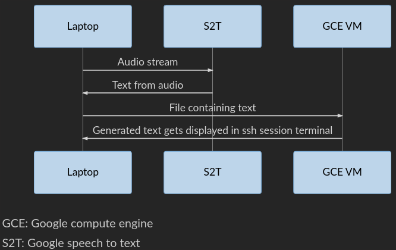

# Eavesdrop 
Eavesdrop listens to conversations and takes that input and combines it based on nouns and verbs with input from pre-written material eg. a movie script. This modified material is then fed into the gpt-2 algorithm to generate a story. 

## Inspiration
Inspired by the video game in the tv show "Silicon Valley" that listens to players and changes game scenes to include advertisements based on their conversation.

## How we built it
We modified a script from the google cloud platform to generate input from speech to text. We then used primarily python to interface between the conversational input, the movie script and the gtp-2 algorithm. 

## Challenges we ran into
Our laptops did not have the computational power to run the GTP-2 model efficiently so we had to offload the computation to the cloud.

## What's next for Eavesdrop
- Adding text to speech output to read the modified material back to the users.
- Sending output to a animated movie scene generator to dynamically generate upcoming scenes in the movie that include prompts from the watchers conversations during previous scenes.

## Implementation
Because of the low computing power of our laptops, we offloaded text generation to the cloud on a Google Compute Engine VM.



## How to run
Git clone the repository 
```sh
git clone https://github.com/DakotaDoolaege/Eavesdrop.git
```
### Local Installation
`cd` into the Eavesdrop directory and activate a virtual environment
```sh
virtualenv myvenv
```


```sh
python interactive_conditional_samples.py  --top_k 40 --model_name 124M --length 200
```

## Notable libraries and tools used
- [Cloud Platform (Google)](https://cloud.google.com/)
- [GPT-2 (OpenAI)](https://github.com/openai/gpt-2)
- [Speech to Text (Google)](https://cloud.google.com/speech-to-text/)
- [Natural Language Toolkit (NLTK)](https://www.nltk.org/)

## Team

- [Bryson Pelechaty](https://github.com/Bryson-P)
- [Dakota Doolaege](https://github.com/DakotaDoolaege)
- [Teagan Johner](https://github.com/tdjohner)


#### Notes
GTP-2 algorithm was trained by [OpenAI](https://github.com/openai/gpt-2) on outbound Reddit links. Because the links were not moderated by OpenAI, the algorithm can sometimes output NSFW content.


